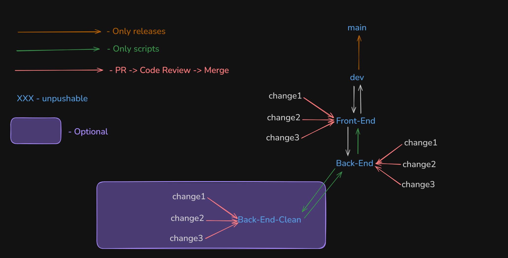
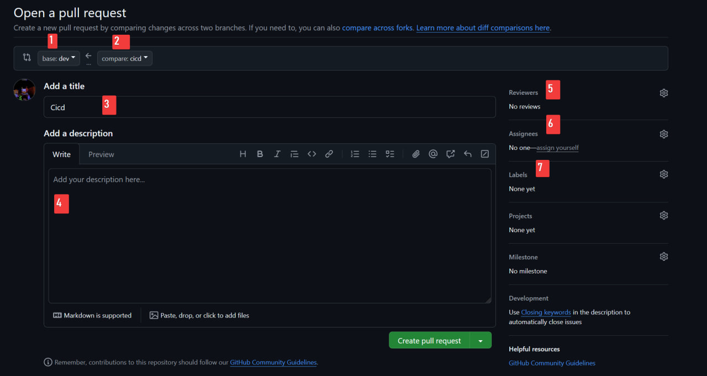
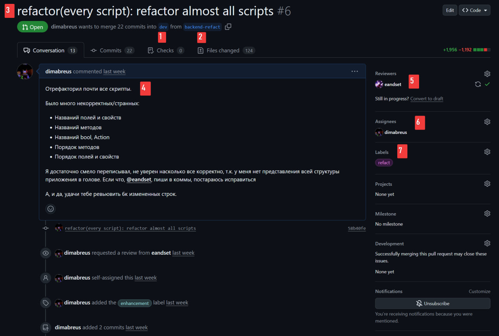

# GitBranchingUnity

Ветвление Git при использовании Unity.



### Структура Pull Request'ов:

Когда разработчик сделал желаемые изменения в своей ветке и удовлетворён результатом он открывает Pull Request на смёрдживание в основную (base) ветку.
При создании Pull Request важно указать правильные параметры:
1. **base** - в какую ветку данные изменения должны смёрджиться. Если данная ветка `front/[feature name]` то в `frontend`, если `back/[feature name]` - `backend`.
2. **compare** - ветка, в которой находятся основные изменения и именно они будут мёрджиться. Данная ветка (`front/[feature name]` или `back/[feature name]`).
3. **Title** *(заголовок)* - Краткое описание изменений. Например: `front/ui update`, `back/scripts refactoring`.
4. **Description** *(описание)* - Подробное описание изменений, можно на русском.
5. **Reviewers** - указать участников, которые будут рассматривать данный PR. Обычно это `@dimabreus` и `@eandset`. Они будут автоматически уведомлены - не надо их дополнительно пинговать в описание без особой причины.
6. **Assignees** - участники, которые отвечают за данный PR и будут исправлять изменения в PR при необходимости.
7. **Labels** - флаги, которые соответствуют изменениям:
  - `bug` - исправление какой-либо ошибки.
  - `documentation` - изменение документации (`README.md`).
  - `enhancement` - улучшение или добавление какого-либо функционала.
  - `refact` - рефакторинг кода.
  - есть и другие labels, но они созданы для Issues и не должны использоваться в Pull Request'ах.




После создания Pull Request'а один из Reviewer'ов по возможности проверит данный Pull Request. Если всё хорошо, то данный reviewer подтверждает (approve) изменения и мёрджит их в основную ветку. Но также Reviewer может оставить комментарий в случае если ему что то не понравилось, это включает:
- Код не соответствует [правилам написания кода](https://github.com/Strong-editor-team/CodeStyle).
- Что-то реализовано не так, как должно.
- Reviewer не уверен в каком-то из изменений и требует объяснения.

Если такое случилось то reviewer оставляет комментарий, где просит что-либо объяснить либо изменить. Это автоматически уведомит **Assignees**. Они в ответ могут создать коммит, который это исправляет либо просто ответить на комментарий и после этого процесс повторяется.

> [!IMPORTANT]
> Это не означает, что каждый коммит теперь должен выделяться в отдельный Pull Request и описываться. Pull Request'ы создаются для отдельных фич/исправлений, каждый PR может содержать несколько коммитов.

### Общая структура:

```
   main
     ↓
    dev
     ↓
 frontend
     ↓
  backend
     ↓
backend-clean
```

- `main` - основная ветка, изменения в ней не делаются. В эту ветку сливаются Major и Minor изменения с ветки `dev`.
- `dev` - производная ветка от `main`, изменения в ней не делаются. В этой ветке находится актуальная версия проекта. От ветки `main` она ничего не наследует, но иногда ветка `dev` *merge*-тся в `main`.
- `frontend` - производная ветка от `dev`, напрямую в неё ничего не пушится. В ней делаются изменения Front части игры (визуальная часть игры - сцены и тд.). Для каждого изменения делается производная ветка от `frontend` с названием `front/[feature name]`, в ней разработчик делает свою работу и когда закончит открывает Pull Request на слияние его ветки в ветку `frontend` в соответствии со структурой Pull Request'ов описанной выше. `frontend` синхронизирован с `dev`
- `backend` - производная ветка от `frontend`, напрямую в неё ничего не пушится. В ней делаются изменения Back части игры (скрипты,  и тд.). Для каждого изменения делается производная ветка от `backend` с названием `back/[feature name]`, в ней разработчик делает свою работу и когда закончит открывает Pull Request на слияние его ветки в ветку `backend` в соответствии со структурой Pull Request'ов описанной выше. `backend` имеет в себе изменения `frontend`, но при этом на `frontend` с `backend` посылаются только изменения скриптов.
- `backend-clean` - производная ветка от `backend`. Вводится только если визуальная часть проекта разрослась и требует много производительности, которая на `backend` не нужна. Она в полу-синхронизации с `backend` - они никогда не одинаковы. Изначально с `backend` на `backend-clean` переходят только скрипты. В `backend-clean` создаются минимальные сцены для проверки скриптов. После чего они в относительной синхронизации между друг другом. Каждый раз когда на backend происходит коммит он `cherry-pick`'ается на `backend-clean` и наоборот. Используется аналогичная система для изменений как в `frontend` и `backend`.

### Дополнительные случаи:

Так как PR не мгновенно смёрдживаются в основную ветку, а требуют определённого времени на проверку и при необходимости доработку это может останавливать разработчика от разработки последующих изменений, т.к. они могут отталкиваться от изменений в этом PR. В этом случае не надо пихать всё в один PR или просто ждать пока PR смёрджнут. Можно создать производную ветку от ветки с PR, и делать в ней изменения, по аналогии со структурой pull request'ов при достижении желаемого функционала должен создаваться pull request, но в **base** указать основную ветку основной ветки (т.е. если основная ветка `/back/effect manager refactoring`, то надо указать `backend`). Таким образом для начала будет необходимо смёрджить основной PR, чтобы смёрджить данный PR.
